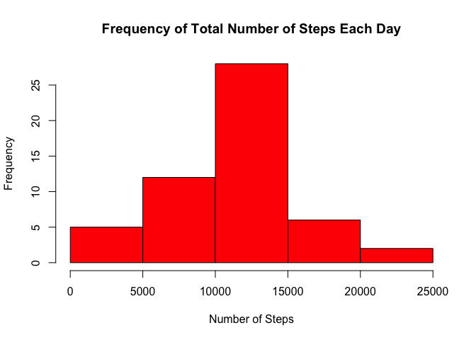
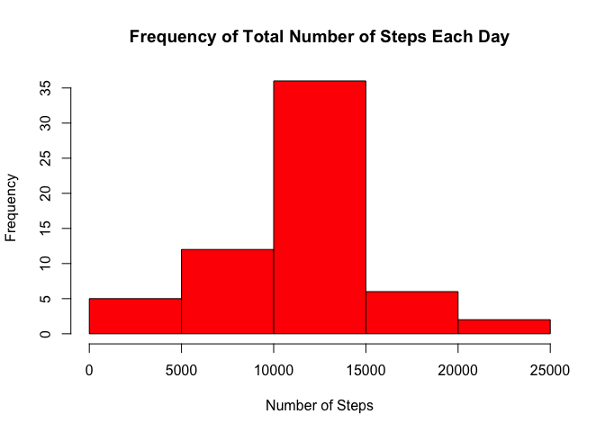
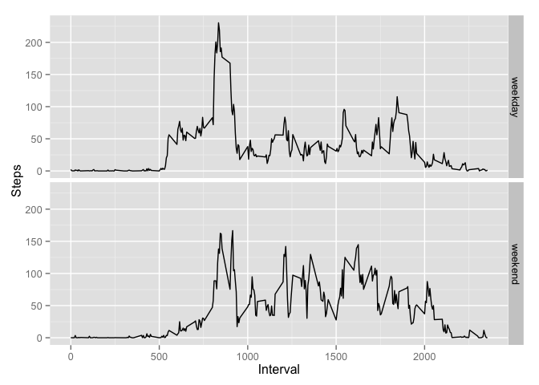

# Reproducible Research: Peer Assessment 1

## Setting global options

```r
    library(knitr)
    opts_chunk$set(echo=TRUE)
```

## Loading and preprocessing the data

```r
    unzip("activity.zip")
    df <- read.csv("activity.csv", header=TRUE)
    df$date <- as.Date(df$date)
```

## What is mean total number of steps taken per day?

```r
    good <- complete.cases(df)    
    df2 <- aggregate(x=list(Steps = df[good,]$steps), by=list(Date = df[good,]$date), FUN=sum)
    hist(df2$Steps, col = "red", main = "Frequency of Total Number of Steps Each Day", 
         xlab = "Number of Steps", ylab = "Frequency")
```

 

```r
    meanSteps <- mean(df2$Steps)
    medianSteps <- median(df2$Steps)
```

The mean total number of steps taken per day is 1.0766 &times; 10<sup>4</sup>.  
The median total number of steps taken per day is 10765.

## What is the average daily activity pattern?

```r
    df3 <- aggregate(x=list(MeanSteps = df[good,]$steps), by=list(Interval = df[good,]$interval), FUN=mean)
    with(df3, plot(Interval, MeanSteps, type = "l", 
                    xlab = "Time (24 hours)",
                    ylab = "Average Number of Steps", 
                    main = "Average Daily Activity Pattern"))
```

 

```r
    mostActiveInterval <- df3[df3$MeanSteps == max(df3$MeanSteps), ]$Interval
```

The most active time, on average, is 835.

## Imputing missing values

```r
    missingCount <- nrow(df[!good,])
    df4 <- merge(df, df3, by.x = "interval", by.y = "Interval")
    df4$steps[is.na(df4$steps)] <- df4$MeanSteps[is.na(df4$steps)]

    df5 <- aggregate(x=list(Steps = df4$steps), by=list(Date = df4$date), FUN=sum)
    hist(df5$Steps, col = "red", main = "Frequency of Total Number of Steps Each Day", 
         xlab = "Number of Steps", ylab = "Frequency")
```

 

```r
    meanStepsEst <- mean(df5$Steps)
    medianStepsEst <- median(df5$Steps)
```

The number of rows with missing values is 2304.  
The mean total number of steps taken per day is 1.0766 &times; 10<sup>4</sup>.  
The median total number of steps taken per day is 1.0766 &times; 10<sup>4</sup>.

These values do not differ significantly from previous estimates.  There is virtually no
impact from imputing missing data.  

## Are there differences in activity patterns between weekdays and weekends?

```r
    library(ggplot2)
    df4$daytype <- factor(ifelse(!weekdays(df4$date) %in% c("Saturday", "Sunday"), 
                                 "weekday", "weekend"))
    df6 <- aggregate(x=list(Steps = df4$steps), 
                     by=list(Interval = df4$interval, DayType = df4$daytype ), 
                     FUN=mean)
    qplot(Interval, Steps, data=df6, facets = DayType ~ ., geom="line")    
```

 

There is about one third greater activity during the weekdays around the 8:30 AM time period than on the weekends.  However, activity drops after that during the week for the rest of the day, while it stays at a higher level through the weekend days.
